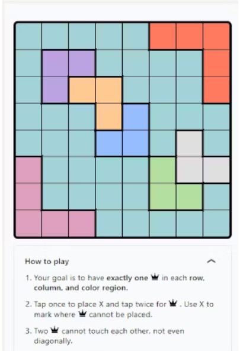
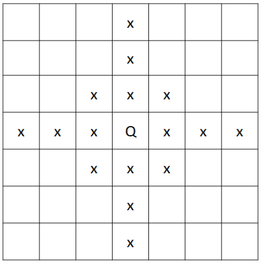
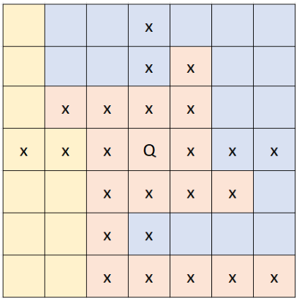
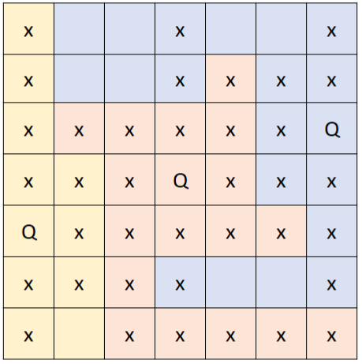

# Queens Game Solver
> Task Seleksi IRK created by Alex

versi **9 Juli 2024**
## 💡 Latar Belakang
Sebagai seorang mahasiswa, tentu kita tidak asing dengan platform LinkedIn sebagai platform karir. Tapi apakah Anda tahu bahwa LinkedIn menyediakan permainan-permainan untuk penggunanya? Salah satu permainan yang disediakan adalah Queens Game. Objektif dari game ini adalah mengalokasikan sebuah “Queen” pada setiap area warna dengan aturan-aturan tertentu. 

 

## 📝 Spesifikasi Tugas
Dalam tugas besar ini, Anda diminta untuk membuat program pencari solusi permainan Queens Game berdasarkan input papan dengan algoritma-algoritma yang telah dipelajari pada mata kuliah IF2211 Strategi Algoritma.

Berdasarkan permainan yang disediakan LinkedIn, berikut adalah peraturannya:
Objektif permainan adalah mengalokasikan sebuah “Queen” pada setiap region warna.
Setiap kolom dan baris hanya diperbolehkan teralokasi sebuah “Queen”.
Tidak ada “Queen” yang saling bersentuhan (8 tiles sekitar sebuah “Queen”).

Gambar di atas merupakan contoh restriksi alokasi Queen berdasarkan aturan 2 dan 3. (Q = Objek Queen, x = posisi Queen lain yang tidak mungkin)

Gambar di atas merupakan contoh restriksi alokasi Queen berdasarkan aturan 1, 2, dan 3. (Q = Objek Queen, x = posisi Queen lain yang tidak mungkin)

Gambar di atas merupakan contoh solusi yang memungkinkan dari state papan catur tersebut. (Q = Objek Queen, x = posisi Queen lain yang tidak mungkin)

Perlu dicatat bahwa sebuah region warna akan selalu terhubung. Tidak ada sebuah region warna yang dipisahkan oleh region warna yang lain. 

### Fitur Wajib (1200 Poin)
1. Algoritma yang digunakan untuk pencarian solusi.
    Algoritma yang dapat digunakan adalah salah satu dari: BFS; DFS; atau algoritma lain yang telah diajarkan di mata kuliah Strategi Algoritma. Algoritma harus diimplementasikan sendiri.

2. Input dari program berupa sebuah file .txt yang berisi dimensi papan, jumlah region warna yang ada, dan konfigurasi warna papan. Warna papan direpresentasikan dengan sebuah alfanumerik.
    Contoh:
     
    4 5 
    3 
    A A A @ @ 
    A A 2 @ @ 
    A 2 2 2 @ 
    2 2 2 2 @ 

Pada contoh input di atas, barisan pertama diisi dengan dimensi papan, baris kedua diisi dengan jumlah warna yang ada di papan (region warna), dan baris baris berikutnya diisi dengan konfigurasi warna papan sesuai dengan input barisan sebelumnya. 

3. Output dari program berupa salah satu solusi pengalokasian “Queen” yang mengikuti aturan permainan Queens Game. Output ditampilkan setelah menjalankan algoritma melalui sebuah tombol. Solusi langsung ditampilkan pada papan permainan yang. Pada solusi, kemunculan simbol “x” tidak harus ditampilkan.

4. Bahasa pemrograman yang digunakan dibebaskan, namun diwajibkan untuk membuat sebuah interface (GUI).

### Bonus (1100 Poin)
1. Algoritma tambahan di luar algoritma yang diajarkan pada mata kuliah Strategi Algoritma (Tetap harus mengimplementasikan algoritma pada fitur wajib No. 1). Pengguna dapat mengubah algoritma yang digunakan melalui GUI.
2. Modifikasi Papan secara langsung pada GUI (Modifikasi termasuk region warna dan ukuran pada papan).
3. Objek Queen yang dialokasikan pada papan dapat diubah mencari Chess piece standar permainan catur. Aturan warna tetap berlaku. Objek yang harus diimplementasikan adalah:
    * Queen standar catur
    * Rook
    * Bishop
    * Knight

## ❓ Hal yang Perlu Diperhatikan
- Tidak ada batasan untuk bahasa atau framework yang dipakai.
- Buatlah README untuk dokumentasi pengembangan yang seminimal-minimalnya terdiri dari:     
    - Deskripsi aplikasi
    - Teknologi, bahasa, dan framework yang digunakan
    - Struktur program
    - Penjelasan dan penggunaan algoritma, disertai dengan alasan kenapa menggunakan algoritma tersebut
    - Cara menjalankan program
    - Referensi belajar
- Jika terdapat kesamaan kode yang signifikan dengan kode orang lain atau kode yang ada di internet, maka akan dikenakan sanksi sesuai dengan kebijakan lab IRK.

## 📂 Pengerjaan dan Pengumpulan
1. Buatlah repositori **private** pada github masing-masing dan invite `maximatey` dalam repositori tersebut.
2. Berkas yang dikumpulkan berupa **link rilis tag ke repositori github** yang telah dibuat dengan ketentuan sebagai berikut.
    - Memberikan tag `vn` pada commit terakhir Anda setiap kali ingin melakukan submisi dengan `n` adalah jumlah submisi yang telah dilakukan. (contoh: `v1` untuk submisi pertama).
    - **Tidak menggunakan *url shortener*** (bit.ly, shortlink, atau yang lain) saat melakukan pengumpulan *task*.
    - Anda dapat melakukan rilis dengan panduan [berikut](https://docs.github.com/en/repositories/releasing-projects-on-github/managing-releases-in-a-repository).
3. **Lakukan submisi** pada website seleksi IRK dengan menggunakan akun std.stei.itb.ac.id, **lakukan konfirmasi** ke LINE `maximatey`, dan **jadwalkan demo** dengan cara yang sama. Lakukan hal yang sama jika membuat rilis yang baru. *Tidak kontak untuk demo == Tidak dapet nilai*
4. Jika terdapat pertanyaan dapat menghubungi LINE `maximatey`.

## 📌 Penilaian
| Fitur Wajib | Skor Maksimum |
| ------------- | ------------- |
| Algoritma | 400 |
| Program | 300 |
| Solusi | 400 |
| GUI | 100 |

| Bonus | Skor Maksimum |
| ------------- | ------------- |
| Algoritma Unik | 300 |
| Modifikasi Papan | 200 |
| Modifikasi Piece | 600 |

**TOTAL SKOR : 2300**
 
